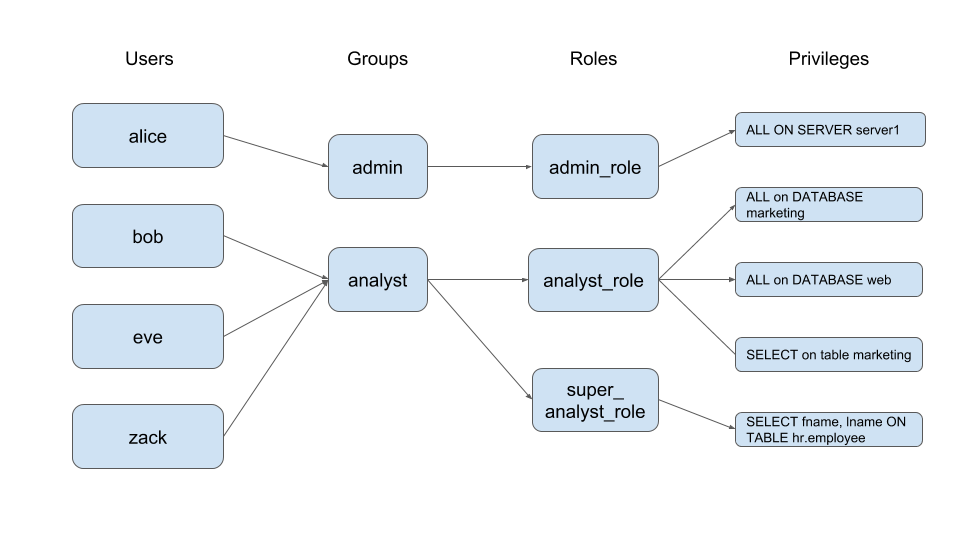

# Custom-plugin-demo/rbac

a custom plugin demo (RBAC modular). Role-based-access-control (RBAC) is a policy neutral access control mechanism defined around roles and privileges. The components of RBAC such as role-permissions, user-role and role-role relationships make it simple to perform user assignments. A study by NIST has demonstrated that RBAC addresses many needs of commercial and government organizations[citation needed]. RBAC can be used to facilitate administration of security in large organizations with hundreds of users and thousands of permissions. Although RBAC is different from MAC and DAC access control frameworks, it can enforce these policies without any complication.



### Building

```sh
go build -buildmode=plugin -o rbac.so rbac.go std_model.go config.go
```

### Usage

```sh
# ./apiproxier -plugin=PLUGIN_NAME:SAHRED_OBJ:CONFIG_FILE
apiproxier -plugin=rbac:rbac.so:config.json # and other flags
```

> if you see the error: `plugin was built with a different version of package`, you must make sure the `apiproxier` has no change after you build the `plugin[rbac]`; the best way is recompiling two file. Make sure: **github.com/jademperor/api-proxier/plugin**'s version is correct.

### Notices

* must implement **[github.com/jademperor/api-proxier/plugin.Plugin](https://github.com/jademperor/api-proxier/blob/master/plugin/plugin.go#L27)**, prototype if following:
```go
// Plugin type Plugin want to save all plugin
type Plugin interface {
	Handle(ctx *Context)
	Status() PlgStatus
	Enabled() bool
	Name() string
	Enable(enabled bool)
}
```
* must have **[New]** func, prototype if following:
```go
func New(cfgData []byte) plugin.Plugin
```